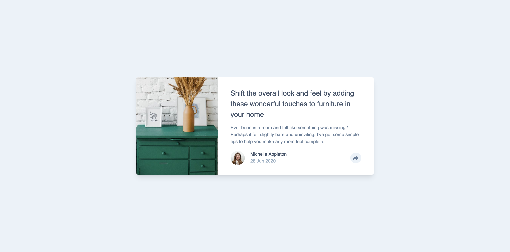
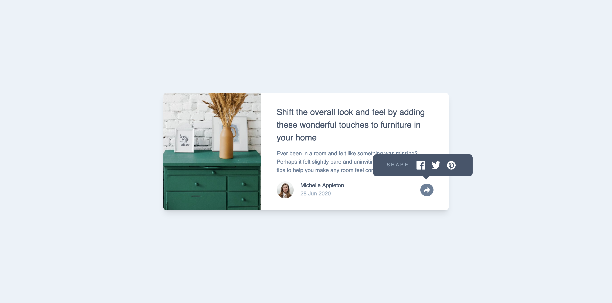
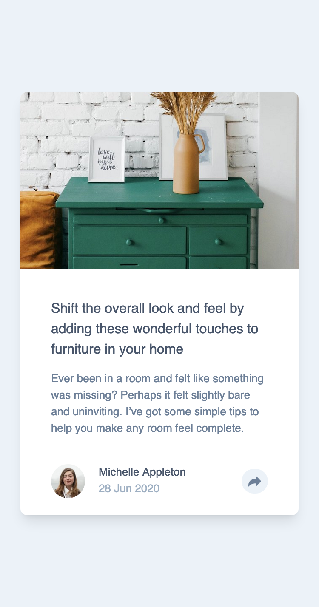
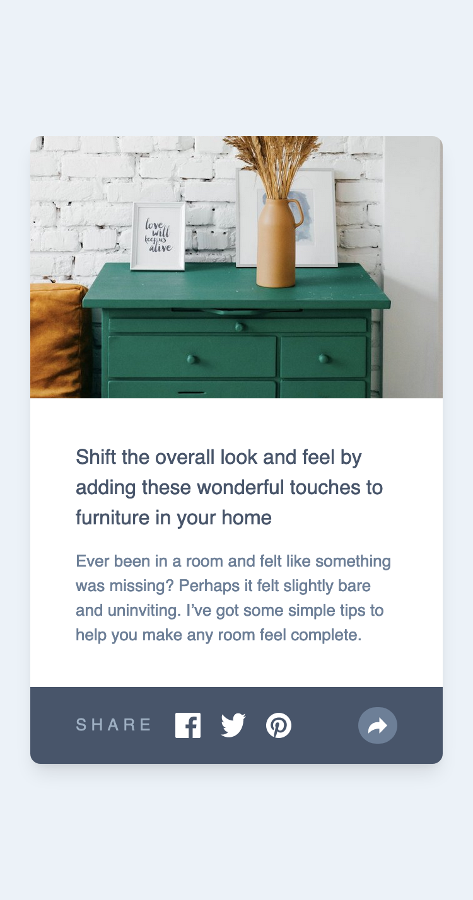

# Frontend Mentor - Article preview component solution

This is a solution to the [Article preview component challenge on Frontend Mentor](https://www.frontendmentor.io/challenges/article-preview-component-dYBN_pYFT). Frontend Mentor challenges help you improve your coding skills by building realistic projects.

## Table of contents

- [Overview](#overview)
  - [Screenshot](#screenshot)
  - [Links](#links)
- [My process](#my-process)
  - [Built with](#built-with)
- [Author](#author)
- [Getting Started](#getting-started-with-next.js)

## Overview

### Screenshot






### Links

- Solution URL: [solution](https://github.com/nguyensylvie/article-preview)
- Live Site URL: [live site](article-preview-nguyensylvie.vercel.app)

## My process

### Built with

- Next.js
- Tailwind

## Author

- Frontend Mentor - [@nguyensylvie](https://www.frontendmentor.io/profile/nguyensylvie)

## Getting Started with Next.js

This is a [Next.js](https://nextjs.org/) project bootstrapped with [`create-next-app`](https://github.com/vercel/next.js/tree/canary/packages/create-next-app).

First, run the development server:

```bash
npm run dev
# or
yarn dev
# or
pnpm dev
```

Open [http://localhost:3000](http://localhost:3000) with your browser to see the result.
